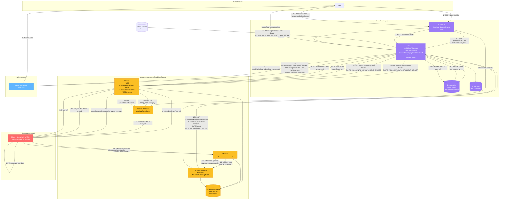

<div align="center">


<br/>


<br/><br/>

[](LICENSE)
[](https://github.com/elixpo/accounts.elixpo/commits/main)
[](https://github.com/elixpo/accounts.elixpo/issues)
[](https://github.com/elixpo/accounts.elixpo/stargazers)

</div>

---

## What is this?

**Elixpo Accounts** is your single login for every Elixpo product — chat, art, blogs, sketch, the URL shortener, and anything else we build.

Make one account here, and you're signed in everywhere. No separate passwords. No juggling logins.

For your everyday use, you don't need to touch this repo at all — just go to **[accounts.elixpo.com](https://accounts.elixpo.com)** and sign up.

---

## What can I do with my account?

- **Sign in once.** Use your Elixpo account on any Elixpo site without making a new login.
- **Choose how to sign in.** Email + password, Google, or GitHub — pick whichever you prefer.
- **Manage your profile in one place.** Update your display name, picture, and bio. Every Elixpo product stays in sync.
- **See which apps you've connected.** Visit your dashboard to view and remove app access whenever you want.
- **Delete your account properly.** One click here removes you from every Elixpo product — no orphaned data left behind.

---

## I'm a developer — can I let users sign in with Elixpo?

Yes. Anyone can register an app and add a "Sign in with Elixpo" button on their site.

1. Sign in at [accounts.elixpo.com](https://accounts.elixpo.com).
2. Open the dashboard → **OAuth Apps** → register a new app.
3. Follow the integration guide: **[docs/OAUTH_INTEGRATION.md](docs/OAUTH_INTEGRATION.md)**.

You also get webhook events (like "user deleted their account") so your app can stay in sync automatically.

---

## Architecture

How accounts.elixpo connects to the rest of the Elixpo ecosystem (Pay for billing, Mails for transactional email) and how Razorpay sits in the loop for INR autopay.



### Secrets and where they live

| Secret | Set on | What it authenticates |
|---|---|---|
| `ELIXPO_ACCOUNTS_PAYOUT_CLIENT_SECRET` (`lix_pay_…`) | accounts CF env + GitHub repo secrets | accounts → payouts `/v1/*` Bearer; also gates inbound `/api/cron/sync-tiers` from the GH workflow |
| `PAYOUTS_WEBHOOK_SECRET` (`whsec_…`) | accounts CF env | Inbound `entitlement.updated` from payouts — verified by HMAC-SHA256 on `X-Elixpo-Pay-Signature` |
| `MAILS_SHARED_SECRET` | accounts CF env | Outbound calls to mails.elixpo — HMAC-SHA256 on `X-Elixpo-Signature: t=…,v1=…` over `${t}.${rawBody}` |
| `MAILS_HOOK_*` (12 keys) | accounts CF env | Per-template endpoint id on mails.elixpo (one per template: `user_verify_otp`, `billing_subscription_activated`, etc.) |
| `RAZORPAY_KEY_ID` / `RAZORPAY_KEY_SECRET` / `RAZORPAY_WEBHOOK_SECRET` | **payouts only** | Razorpay HTTP Basic auth + webhook signature |
| `JWT_PRIVATE_KEY` / `JWT_PUBLIC_KEY` (EdDSA PEM) | accounts CF env | Signing access + refresh tokens (cookie `access_token`) |
| `MFA_JWT_SECRET` | accounts CF env | Short-lived MFA challenge tokens |
| `TRUSTED_DEVICE_SECRET` | accounts CF env | 30-day trusted-device cookie JWT |

---

## Want to help build it?

This is open source. Pull requests are welcome.

If you want to run it on your machine or send a change, here's the short version:

```bash
git clone https://github.com/elixpo/accounts.elixpo.git
cd accounts.elixpo
npm install
cp .env.example .env.local       # fill in the blanks
npm run db:migrate:local         # set up the local database
npm run dev                      # open http://localhost:3000
```

For the full developer manual — architecture, conventions, what to do and what to avoid — read **[AGENTS.md](AGENTS.md)**.

---

## Found a bug? Have an idea?

Open an issue → **[github.com/elixpo/accounts.elixpo/issues](https://github.com/elixpo/accounts.elixpo/issues)**.

For security issues, please email us privately instead of opening a public issue.

---

<div align="center">

Made with care by the **[Elixpo](https://github.com/elixpo) Open Source Team**.

</div>


