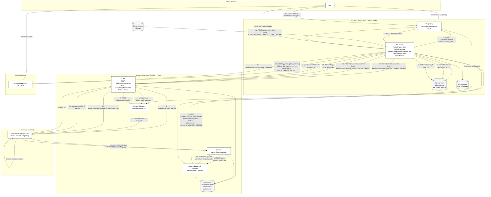

<!--
  ELIXPO README - follows the Elixpo README standard (see STANDARDS.md §4).
  Section order: banner/title/tagline + quick links, About, Ecosystem,
  Architecture, Built by the community, Recognition & programs, Get involved,
  Brand assets, License, Exclusive.
-->

<div align="center">


<br/>


<br/><br/>

<strong>One identity (SSO) across the entire Elixpo ecosystem.</strong><br/>
Open OAuth 2.0 single sign-on, built on Cloudflare's edge. Free and open source.

<br/><br/>

<a href="https://accounts.elixpo.com">accounts.elixpo.com</a> ·
<a href="https://github.com/orgs/elixpo/discussions">Discussions</a> ·
<a href="https://github.com/elixpo/elixpo_chapter">Monorepo</a> ·
<a href="https://github.com/sponsors/Circuit-Overtime">Sponsor</a>

<br/><br/>

[](LICENSE)
[](https://github.com/elixpo/accounts.elixpo/commits/main)
[](https://github.com/elixpo/accounts.elixpo/issues)
[](https://github.com/elixpo/accounts.elixpo/stargazers)

</div>

---

## About

**Elixpo Accounts** is your single login for every Elixpo product — chat, art,
blogs, sketch, the URL shortener, and anything else we build. It is the OAuth
2.0 / SSO identity provider that the rest of the ecosystem authenticates
through, running on Cloudflare Pages with the edge runtime.

Make one account here, and you're signed in everywhere. No separate passwords,
no juggling logins. For everyday use you don't need to touch this repo at all —
just go to **[accounts.elixpo.com](https://accounts.elixpo.com)** and sign up.

> This repository is the source for **accounts.elixpo.com** — the central
> identity node of the Elixpo ecosystem. Every SSO-backed product authenticates
> through it.

### What can I do with my account?

- **Sign in once.** Use your Elixpo account on any Elixpo site without making a new login.
- **Choose how to sign in.** Email + password, Google, or GitHub — pick whichever you prefer.
- **Manage your profile in one place.** Update your display name, picture, and bio. Every Elixpo product stays in sync.
- **See which apps you've connected.** Visit your dashboard to view and remove app access whenever you want.
- **Delete your account properly.** One click here removes you from every Elixpo product — no orphaned data left behind.

### I'm a developer — can I let users sign in with Elixpo?

Yes. Anyone can register an app and add a "Sign in with Elixpo" button on their site.

1. Sign in at [accounts.elixpo.com](https://accounts.elixpo.com).
2. Open the dashboard → **OAuth Apps** → register a new app.
3. Follow the integration guide: **[docs/OAUTH_INTEGRATION.md](docs/OAUTH_INTEGRATION.md)**.

You also get webhook events (like "user deleted their account") so your app can stay in sync automatically.

### Running this locally

This repo runs on **Cloudflare Pages with the edge runtime** (not Node) and uses
**Cloudflare D1 (SQLite)**. The full operating manual — architecture,
edge-runtime constraints, repo layout, migrations, the biome workflow, and
common mistakes — lives in [AGENTS.md](AGENTS.md). Read it before any non-trivial
change.

```bash
npm install                # Node 22+
cp .env.example .env.local # then fill in the values
npm run dev                # Next dev server → http://localhost:3000
npm test                   # vitest
./biome.sh                 # auto-fix lint/format
./biome.sh ci              # strict check — must pass before commit (enforced by CI)
npm run pages:build        # catches edge-runtime incompatibilities
```

Database migrations live in `src/workers/migrations/NNNN_<name>.sql` (gapless
numbering) and are applied via CI on merge to `main`. See
[CONTRIBUTING.md](CONTRIBUTING.md) and [AGENTS.md](AGENTS.md) for the full
contributor and dev workflow.

## The ecosystem

| Tool | What it does | Link |
| --- | --- | --- |
| 🎨 **Elixpo Art** | AI image generation _(under dev)_ | [art.elixpo.com](https://elixpo.com) |
| ✍️ **Elixpo Blogs** | A rich, modern writing and publishing space | [blogs.elixpo.com](https://blogs.elixpo.com) |
| 🖊️ **LixSketch** | A hand-drawn style whiteboard for ideas and diagrams | [sketch.elixpo.com](https://sketch.elixpo.com) |
| 💬 **Elixpo Chat** | A fluid, real-time AI chat experience _(under dev)_ | [chat.elixpo.com](https://chat.elixpo.com) |
| 🔎 **Elixpo Search** | Fast, AI-assisted search | [search.elixpo.com](https://search.elixpo.com) |
| 👤 **Elixpo Accounts** | One identity (SSO) across the ecosystem | [accounts.elixpo.com](https://accounts.elixpo.com) |
| 🔗 **lixrl** | Our flagship URL shortener | [lixrl.com](https://lixrl.com) |
| 🪪 **Portfolios** | Personal pages to showcase your work | [me.elixpo.com](https://me.elixpo.com) |
| 🐼 **Oreo** | The mascot's home | [oreo.elixpo.com](https://oreo.elixpo.com) |

Developers can drop our editors into their own projects with the
**`@elixpo/lixsketch`** and **`@elixpo/lixeditor`** packages, on npm and as VS
Code extensions.

## Architecture

Elixpo Accounts is the central **SSO / identity node** of the ecosystem: SaaS
products (Blogs, Art, Chat, Sketch, Search) and the flagship **lixrl.com** all
authenticate through it. The diagram below shows how accounts.elixpo connects to
the rest of the platform — **Payouts** for billing and **Mails** for
transactional email — and how Razorpay sits in the loop for INR autopay.



A rendered, interactive view of the whole ecosystem lives at
**[elixpo.com/architecture](https://elixpo.com/architecture)**.

## Built by the community

Elixpo is made by people, in the open. **45+ contributors** have shaped these
tools, with a small core team steering the way:

- **Ayushman Bhattacharya** - Founder & Lead ([@Circuit-Overtime](https://github.com/Circuit-Overtime))
- **Vivek Yadav** - Lead Co-Dev ([@ez-vivek](https://github.com/ez-vivek))
- **Anwesha Chakraborty** - Core Maintainer ([@anwe-ch](https://github.com/anwe-ch))

Everyone is welcome. See **[CONTRIBUTING.md](CONTRIBUTING.md)** and our
**[Code of Conduct](CODE_OF_CONDUCT.md)**.

## Recognition & programs

Elixpo has taken part in and been supported by **GSSOC**, **Hacktoberfest**,
**Pollinations.AI**, **MS Startup Foundations**, and **OSCI**.

## Get involved

- 💬 **Join the conversation** in [GitHub Discussions](https://github.com/orgs/elixpo/discussions).
- 🚀 **Submit your project** to be featured across the ecosystem.
- 🛠️ **Contribute** - browse good first issues in the [monorepo](https://github.com/elixpo/elixpo_chapter).
- ❤️ **Support us** via [GitHub Sponsors](https://github.com/sponsors/Circuit-Overtime).

For security issues, please email us privately instead of opening a public issue.

## Brand assets

Brand-ready marks and per-service icons live under [`public/`](public/), and the
brand source of truth (mascot, palette, rules) is maintained in the
[`elixpo`](https://github.com/elixpo/elixpo) repo. A browsable kit is at
**[elixpo.com/assets](https://elixpo.com/assets)**.

## License

Elixpo uses one **licensing standard** across every repository:

- **Code** - [MIT](LICENSES/preferred/MIT) (with the [Oreo-trademarks exception](LICENSES/exceptions/Oreo-trademarks)).
- **Brand & visual assets** - [CC-BY-4.0](LICENSES/preferred/CC-BY-4.0) (with the same exception).

The Oreo mascot, the chest E-badge, and the "Elixpo" and "Oreo" names, domains,
and palette are reserved - this protects the brand and its royalties while
keeping the code and assets free. See [`LICENSE`](LICENSE) and the per-product
notice board, [`NOTICE`](LICENSES/NOTICE).

## Exclusive

> Per-repo "exclusive" artifacts (an npm package, a VS Code extension, a hosted
> SaaS, a paid tier) are declared here and in [`NOTICE`](LICENSES/NOTICE).

**This repository:** Paid subscription tiers. Elixpo Accounts offers paid
**Indie** and **Studio** plans (on top of the free Hobby plan), billed in INR
through the Elixpo payments infrastructure. The paid tiers, pricing, and the
hosted service at accounts.elixpo.com are reserved to Elixpo; the source code
remains MIT.

---

<div align="center">

Made with care by the **[Elixpo](https://github.com/elixpo) Open Source Team**.
<br/>
<sub>Made in the open, together. © 2023-2026 Elixpo.</sub>

</div>


